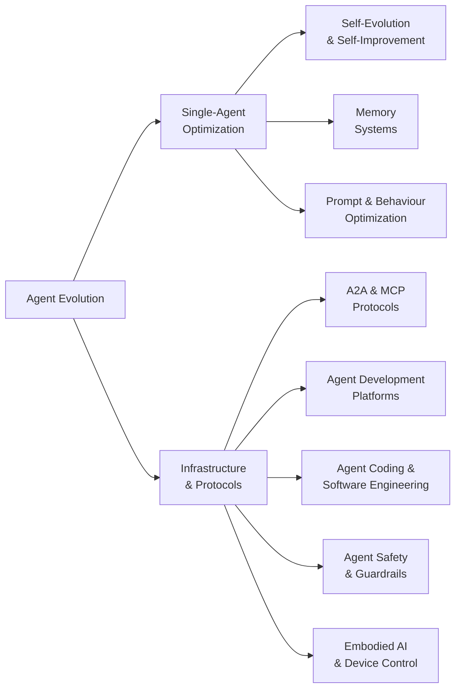

# README.md

```markdown
# Awesome Agent Evolution [](https://awesome.re)

> AI Agent self-evolution, memory systems, autonomous self-improvement, and the infrastructure that powers them.

## Contents

- [Taxonomy](#taxonomy)
- [Agent Evolution and Self-Improvement](#agent-evolution-and-self-improvement)
- [Memory Systems](#memory-systems)
- [Agent-to-Agent Protocols](#agent-to-agent-protocols)
- [Agent Development Platforms](#agent-development-platforms)
- [Agent Coding and Software Engineering](#agent-coding-and-software-engineering)
- [Prompt and Behaviour Optimization](#prompt-and-behaviour-optimization)
- [Agent Safety and Guardrails](#agent-safety-and-guardrails)
- [Embodied AI](#embodied-ai)
- [Key Research Papers](#key-research-papers)
- [Benchmarks and Evaluation](#benchmarks-and-evaluation)
- [Community and Knowledge](#community-and-knowledge)

## Taxonomy



## Agent Evolution and Self-Improvement

Projects focused on enabling AI agents to evolve, learn, and improve autonomously.

<!-- AUTOGEN:evolution -->
- [**Eliza**](https://github.com/elizaOS/eliza) - Autonomous agents for everyone. A framework for creating and deploying AI agents that evolve over time. by [@elizaOS](https://github.com/elizaOS) (18,184 stars)
- [**SuperAGI**](https://github.com/TransformerOptimus/SuperAGI) - A dev-first open source autonomous AI agent framework. Build, manage and run self-improving autonomous agents. by [@TransformerOptimus](https://github.com/TransformerOptimus) (17,446 stars)
- [**Agent Zero**](https://github.com/agent0ai/agent-zero) - General-purpose AI agent framework that learns and evolves through interaction. by [@agent0ai](https://github.com/agent0ai) (17,027 stars)
- [**OpenEvolve**](https://github.com/codelion/openevolve) - Open-source evolutionary coding agent inspired by AlphaEvolve. Evolves code solutions through LLM-driven mutation and selection. by [@codelion](https://github.com/codelion) (5,975 stars)
- [**Agents (aiwaves)**](https://github.com/aiwaves-cn/agents) - An open-source framework for data-centric, self-evolving autonomous language agents. by [@aiwaves-cn](https://github.com/aiwaves-cn) (5,905 stars)
- [**EvoAgentX**](https://github.com/EvoAgentX/EvoAgentX) - Automated framework for evolving agentic workflows. Optimizes agent prompts, tools, and pipelines via evolutionary algorithms. by [@EvoAgentX](https://github.com/EvoAgentX) (2,768 stars)
- [**evolver**](https://github.com/EvoMap/evolver) - The GEP-powered self-evolution engine for AI agents. Genome Evolution Protocol enables agents to evolve autonomously via mutation and selection. by [@EvoMap](https://github.com/EvoMap) (2,511 stars)
- [**HyperAgents**](https://github.com/facebookresearch/HyperAgents) - Self-referential self-improving agents by Meta. DGM-Hyperagents add an optimization layer so agents edit their own improvement process. by [@facebookresearch](https://github.com/facebookresearch) (2,290 stars)
- [**Agent0**](https://github.com/aiming-lab/Agent0) - Self-evolving agent framework from UNC/Salesforce/Stanford. Improves without human-curated datasets via curriculum and executor agent competition. by [@aiming-lab](https://github.com/aiming-lab) (1,155 stars)
- [**Darwin Godel Machine**](https://github.com/jennyzzt/darwin-godel-machine) - Open-ended evolution of self-improving agents. Agents that rewrite their own code to improve performance. by [@jennyzzt](https://github.com/jennyzzt) (800 stars)
- [**Ouroboros**](https://github.com/razzant/ouroboros) - Self-creating AI agent that writes its own code and evolves autonomously. Completed 30+ evolution cycles in first 24 hours with zero human intervention. by [@razzant](https://github.com/razzant) (496 stars)
- [**A-Evolve**](https://github.com/A-EVO-Lab/A-EVOLVE) - The PyTorch for Agentic AI. Open-source infrastructure that evolves any agent across any domain with zero human intervention. #1 on MCP-Atlas (79.4%). by [@A-EVO-Lab](https://github.com/A-EVO-Lab) (478 stars)
- [**Alita**](https://github.com/alita-ai/alita) - Generalist Agent enabling scalable agentic reasoning with minimal predefinition and maximal self-evolution. by [@alita-ai](https://github.com/alita-ai) (400 stars)
- [**SEAgent**](https://github.com/SunzeY/SEAgent) - Self-Evolving Computer Use Agent with Autonomous Learning from Experience. by [@SunzeY](https://github.com/SunzeY) (238 stars)
<!-- /AUTOGEN:evolution -->

## Memory Systems

Vector, graph, episodic, and hybrid memory architectures for persistent agent cognition.

<!-- AUTOGEN:memory -->
- [**Mem0**](https://github.com/mem0ai/mem0) - Production-ready AI agent memory with scalable long-term memory. 26% improvement over baseline on LOCOMO benchmark with 91% latency reduction. by [@mem0ai](https://github.com/mem0ai) (53,159 stars)
- [**Letta**](https://github.com/letta-ai/letta) - Platform for building stateful agents with advanced self-editing memory. Formerly MemGPT. by [@letta-ai](https://github.com/letta-ai) (22,079 stars)
- [**Cognee**](https://github.com/topoteretes/cognee) - Knowledge engine for AI agent memory. Build and query knowledge graphs from unstructured data in 6 lines of code. by [@topoteretes](https://github.com/topoteretes) (15,518 stars)
- [**Memvid**](https://github.com/memvid/memvid) - Single-file memory layer for AI Agents in Rust. +35% SOTA on LoCoMo with ultra-low latency (0.025ms P50). by [@memvid](https://github.com/memvid) (14,930 stars)
- [**memU**](https://github.com/NevaMind-AI/memU) - Memory system for 24/7 proactive agents. Persistent memory across sessions and platforms. by [@NevaMind-AI](https://github.com/NevaMind-AI) (13,355 stars)
- [**MemMachine**](https://github.com/MemMachine/MemMachine) - Universal memory layer for AI agents. Episodic (graph-based), profile (SQL), and working memory with scalable storage and retrieval. by [@MemMachine](https://github.com/MemMachine) (4,121 stars)
- [**EverMemOS**](https://github.com/EverMind-AI/EverMemOS) - Long-term memory for 24/7 AI agents across LLMs and platforms. by [@EverMind-AI](https://github.com/EverMind-AI) (4,004 stars)
- [**memgraph**](https://github.com/memgraph/memgraph) - High-performance open-source in-memory graph database for GraphRAG, AI memory, agentic AI, and real-time graph analytics. Cypher-compatible, built in C++. by [@memgraph](https://github.com/memgraph) (3,909 stars)
- [**Acontext**](https://github.com/memodb-io/Acontext) - Open-source skill memory layer for AI agents. Automatically captures learnings from agent runs and stores them as reusable skill files. by [@memodb-io](https://github.com/memodb-io) (3,310 stars)
- [**ReMe**](https://github.com/agentscope-ai/ReMe) - Memory management kit for agents. File-based and vector-based memory systems. SOTA on LoCoMo and HaluMem benchmarks. by [@agentscope-ai](https://github.com/agentscope-ai) (2,735 stars)
- [**holaOS**](https://github.com/holaboss-ai/holaOS) - Agent environment for long-horizon work, continuity, and self-evolution. by [@holaboss-ai](https://github.com/holaboss-ai) (2,511 stars)
- [**honcho**](https://github.com/plastic-labs/honcho) - Memory library for building stateful agents with user context management. by [@plastic-labs](https://github.com/plastic-labs) (2,451 stars)
- [**mcp-memory-service**](https://github.com/doobidoo/mcp-memory-service) - Open-source persistent memory for AI agent pipelines. REST API + knowledge graph + autonomous consolidation. by [@doobidoo](https://github.com/doobidoo) (1,676 stars)
- [**A-MEM**](https://github.com/agentic-memory/a-mem) - Agentic Memory for LLM Agents. Self-organizing memory that autonomously manages what to remember and forget. by [@agentic-memory](https://github.com/agentic-memory) (1,500 stars)
- [**nocturne_memory**](https://github.com/Dataojitori/nocturne_memory) - Lightweight, rollbackable Long-Term Memory Server for MCP Agents with graph-like structured memory. by [@Dataojitori](https://github.com/Dataojitori) (966 stars)
- [**Mem9**](https://github.com/mem9-ai/mem9) - Unlimited persistent memory layer for AI agents. Cloud-synced memory across sessions and tools. by [@mem9-ai](https://github.com/mem9-ai) (964 stars)
- [**Awesome-AI-Memory**](https://github.com/IAAR-Shanghai/Awesome-AI-Memory) - Curated knowledge base on AI memory for LLMs and agents, covering long-term memory, reasoning, retrieval, and system design. by [@IAAR-Shanghai](https://github.com/IAAR-Shanghai) (737 stars)
- [**TeleMem**](https://github.com/TeleAI-UAGI/telemem) - High-performance drop-in Mem0 replacement. 19% higher accuracy, 43% fewer tokens, and 2.1x speedup via narrative dynamic extraction. by [@TeleAI-UAGI](https://github.com/TeleAI-UAGI) (449 stars)
- [**MemSkill**](https://github.com/ViktorAxelsen/MemSkill) - Learning and evolving memory skills for self-evolving agents. Meta-memory that determines what to extract, remember, and forget. by [@ViktorAxelsen](https://github.com/ViktorAxelsen) (415 stars)
- [**Awesome-Agent-Memory**](https://github.com/TeleAI-UAGI/Awesome-Agent-Memory) - Curated systems, benchmarks, and papers on memory for LLMs/MLLMs -- long-term context, retrieval, and reasoning. by [@TeleAI-UAGI](https://github.com/TeleAI-UAGI) (351 stars)
<!-- /AUTOGEN:memory -->

## Agent-to-Agent Protocols

Standards and protocols for inter-agent communication and interoperability.

<!-- AUTOGEN:protocols -->
- [**Google A2A**](https://github.com/google/A2A) - Google's open Agent-to-Agent protocol. Enables agent discovery, secure collaboration, and long-running tasks while preserving agent opacity. by [@google](https://github.com/google) (23,220 stars)
- [**mcp-use**](https://github.com/mcp-use/mcp-use) - The fullstack MCP framework to develop MCP Apps for ChatGPT/Claude and MCP Servers for AI Agents. by [@mcp-use](https://github.com/mcp-use) (9,775 stars)
- [**GEP MCP Server**](https://github.com/EvoMap/gep-mcp-server) - MCP Server for Genome Evolution Protocol. Exposes evolution tools to Claude Desktop, Cursor, and any MCP client. by [@EvoMap](https://github.com/EvoMap) (1 stars)
<!-- /AUTOGEN:protocols -->

## Agent Development Platforms

Platforms and tools for building, deploying, and managing AI agents.

<!-- AUTOGEN:platforms -->
- [**dify**](https://github.com/langgenius/dify) - Production-ready platform for building agentic AI workflows with visual orchestration. by [@langgenius](https://github.com/langgenius) (137,929 stars)
- [**LangChain**](https://github.com/langchain-ai/langchain) - Full-stack agent engineering platform with composable chains, tools, and memory integration. by [@langchain-ai](https://github.com/langchain-ai) (133,704 stars)
- [**OpenHands**](https://github.com/All-Hands-AI/OpenHands) - Open platform for AI software developers as generalist agents. Autonomous coding, debugging, and deployment. by [@All-Hands-AI](https://github.com/All-Hands-AI) (71,284 stars)
- [**CowAgent**](https://github.com/zhayujie/CowAgent) - Super AI assistant based on LLMs with autonomous thinking, task planning, skill creation, and long-term memory. by [@zhayujie](https://github.com/zhayujie) (43,280 stars)
- [**langgraph**](https://github.com/langchain-ai/langgraph) - Build resilient language agents as stateful graphs with persistence and streaming. by [@langchain-ai](https://github.com/langchain-ai) (29,382 stars)
- [**AgenticSeek**](https://github.com/Fosowl/agenticSeek) - Fully local autonomous agent with browsing, coding, and multi-agent capabilities. No API keys required. by [@Fosowl](https://github.com/Fosowl) (25,932 stars)
- [**haystack**](https://github.com/deepset-ai/haystack) - Open-source AI orchestration framework for building context-engineered production applications. by [@deepset-ai](https://github.com/deepset-ai) (24,844 stars)
- [**mastra**](https://github.com/mastra-ai/mastra) - TypeScript framework for building AI-powered applications with agent workflows and RAG. by [@mastra-ai](https://github.com/mastra-ai) (23,039 stars)
- [**Coze Studio**](https://github.com/coze-dev/coze-studio) - AI agent development platform with visual tools for creating, debugging, and deploying agents. by [@coze-dev](https://github.com/coze-dev) (20,526 stars)
- [**Google ADK**](https://github.com/google/adk-python) - Open-source Python toolkit by Google for building, evaluating, and deploying sophisticated AI agents. by [@google](https://github.com/google) (19,006 stars)
- [**Parlant**](https://github.com/emcie-co/parlant) - The conversational control layer for customer-facing AI agents. A context-engineering framework for controlling interactions. by [@emcie-co](https://github.com/emcie-co) (17,940 stars)
- [**OpenFang**](https://github.com/RightNow-AI/openfang) - Open-source Agent Operating System for deploying and managing AI agents. by [@RightNow-AI](https://github.com/RightNow-AI) (16,656 stars)
- [**PydanticAI**](https://github.com/pydantic/pydantic-ai) - Type-safe AI agent framework built on Pydantic with structured outputs and dependency injection. by [@pydantic](https://github.com/pydantic) (16,393 stars)
- [**CoPaw**](https://github.com/agentscope-ai/CoPaw) - Co Personal Agent Workstation built on AgentScope. Desktop agent platform with multi-agent collaboration and tool integration. by [@agentscope-ai](https://github.com/agentscope-ai) (15,429 stars)
- [**ten-framework**](https://github.com/TEN-framework/ten-framework) - Open-source framework for building conversational voice AI agents. by [@TEN-framework](https://github.com/TEN-framework) (10,415 stars)
- [**agents**](https://github.com/livekit/agents) - Framework for building realtime voice AI agents with speech-to-speech pipelines. by [@livekit](https://github.com/livekit) (10,061 stars)
- [**PySpur**](https://github.com/PySpur-Dev/pyspur) - Visual playground for agentic workflows with rapid iteration on multi-agent pipelines. by [@PySpur-Dev](https://github.com/PySpur-Dev) (5,710 stars)
- [**MS-Agent**](https://github.com/modelscope/ms-agent) - Lightweight framework by ModelScope to empower agentic execution of complex tasks with memory and deep research. by [@modelscope](https://github.com/modelscope) (4,166 stars)
<!-- /AUTOGEN:platforms -->

## Agent Coding and Software Engineering

AI agents that write, debug, and maintain code autonomously.

<!-- AUTOGEN:coding -->
- [**Claude Code**](https://github.com/anthropics/claude-code) - Terminal-native agentic coding tool from Anthropic. Understands your codebase and executes tasks through natural language. by [@anthropics](https://github.com/anthropics) (114,500 stars)
- [**Codex**](https://github.com/openai/codex) - Lightweight coding agent from OpenAI written in Rust. Runs locally as CLI, IDE extension, or desktop app. by [@OpenAI](https://github.com/OpenAI) (75,508 stars)
- [**Aider**](https://github.com/Aider-AI/aider) - AI pair programming in your terminal. Edit code with LLMs across 100+ languages with deep Git integration. by [@Aider-AI](https://github.com/Aider-AI) (43,399 stars)
- [**Goose**](https://github.com/block/goose) - Open-source extensible AI agent that installs, executes, edits, and debugs code autonomously. by [@block](https://github.com/block) (42,217 stars)
- [**goose**](https://github.com/aaif-goose/goose) - Open-source extensible AI coding agent that goes beyond code suggestions. by [@aaif-goose](https://github.com/aaif-goose) (42,217 stars)
- [**Roo Code**](https://github.com/RooCodeInc/Roo-Code) - AI coding agent providing a full dev team of specialized agents inside your code editor. by [@RooCodeInc](https://github.com/RooCodeInc) (23,144 stars)
- [**Devika**](https://github.com/stitionai/devika) - The first open-source implementation of an Agentic Software Engineer. An open-source alternative to Devin. by [@stitionai](https://github.com/stitionai) (19,500 stars)
- [**SWE-Agent**](https://github.com/SWE-agent/SWE-agent) - Automatically fix GitHub issues and handle cybersecurity challenges. State-of-the-art on SWE-bench. by [@SWE-agent](https://github.com/SWE-agent) (18,993 stars)
- [**agent-skills**](https://github.com/addyosmani/agent-skills) - Production-grade engineering skills and best practices for AI coding agents. by [@addyosmani](https://github.com/addyosmani) (15,964 stars)
- [**Plandex**](https://github.com/plandex-ai/plandex) - Open-source AI coding agent designed for large projects and complex real-world tasks with persistent context. by [@plandex-ai](https://github.com/plandex-ai) (15,243 stars)
- [**Trae Agent**](https://github.com/bytedance/trae-agent) - LLM-based agent by ByteDance for general-purpose software engineering tasks. by [@bytedance](https://github.com/bytedance) (11,347 stars)
- [**Open SWE**](https://github.com/langchain-ai/open-swe) - Open-source asynchronous coding agent by LangChain for software engineering tasks. by [@langchain-ai](https://github.com/langchain-ai) (9,563 stars)
- [**Mini-SWE-Agent**](https://github.com/SWE-agent/mini-swe-agent) - The 100-line AI agent that solves GitHub issues. Radically simple but scores >74% on SWE-bench verified. by [@SWE-agent](https://github.com/SWE-agent) (3,850 stars)
- [**Reflexion**](https://github.com/noahshinn/reflexion) - Language agents with verbal reinforcement learning. Agents that learn from mistakes through self-reflection. by [@noahshinn](https://github.com/noahshinn) (3,123 stars)
<!-- /AUTOGEN:coding -->

## Prompt and Behaviour Optimization

Tools and frameworks for automatically optimizing agent prompts, instructions, and behavioral patterns.

<!-- AUTOGEN:prompt-optimization -->
- [**Promptfoo**](https://github.com/promptfoo/promptfoo) - Open-source LLM evaluation and red-teaming framework. Test prompts, agents, and RAGs with 90+ model providers and 67+ security plugins. by [@promptfoo](https://github.com/promptfoo) (20,142 stars)
- [**TextGrad**](https://github.com/zou-group/textgrad) - Automatic differentiation via text. Backpropagation through LLM-provided textual gradients, published in Nature. by [@zou-group](https://github.com/zou-group) (3,490 stars)
<!-- /AUTOGEN:prompt-optimization -->

## Agent Safety and Guardrails

Projects focused on controlling agent actions, enforcing policies, and preventing harmful behavior.

<!-- AUTOGEN:safety -->
- [**NeMo Guardrails**](https://github.com/NVIDIA/NeMo-Guardrails) - NVIDIA's toolkit for adding programmable guardrails to LLM conversational systems. Policy-based safety controls. by [@NVIDIA](https://github.com/NVIDIA) (5,980 stars)
<!-- /AUTOGEN:safety -->

## Embodied AI

Projects connecting AI agents to physical devices, robotics, and real-world environments.

<!-- AUTOGEN:embodied -->
- [**Open-AutoGLM**](https://github.com/zai-org/Open-AutoGLM) - An Open Phone Agent Model and Framework. Unlocking the AI Phone for Everyone. by [@zai-org](https://github.com/zai-org) (24,935 stars)
- [**LeRobot**](https://github.com/huggingface/lerobot) - Open-source robotics framework by Hugging Face. Models, datasets, and tools for real-world robotics in PyTorch. (23,252 stars)
- [**Nanobrowser**](https://github.com/nanobrowser/nanobrowser) - Chrome extension for AI-powered web automation. Run multi-agent workflows using your own AI keys. by [@nanobrowser](https://github.com/nanobrowser) (12,692 stars)
- [**XcodeBuildMCP**](https://github.com/getsentry/XcodeBuildMCP) - A MCP server and CLI for agent use when working on iOS and macOS projects. by [@getsentry](https://github.com/getsentry) (5,214 stars)
- [**Mobile MCP**](https://github.com/mobile-next/mobile-mcp) - Model Context Protocol Server for Mobile Automation and Scraping (iOS, Android, Emulators and Real Devices). by [@mobile-next](https://github.com/mobile-next) (4,550 stars)
- [**ROS-LLM**](https://github.com/Auromix/ROS-LLM) - Framework for embodied intelligence in ROS. Natural language interactions with LLMs for robot control. by [@Auromix](https://github.com/Auromix) (777 stars)
<!-- /AUTOGEN:embodied -->

## Key Research Papers

### Surveys

- [A Comprehensive Survey of Self-Evolving AI Agents](https://arxiv.org/abs/2508.07407) (arXiv'25) - Unified framework with four components: System Inputs, Agent System, Environment, and Optimisers. Covers evolution of models, prompts, memory, tools, and workflows.
- [A Survey of Self-Evolving Agents: What, When, How, and Where to Evolve](https://arxiv.org/abs/2507.21046) (TMLR'26) - Organizes around what to evolve, when to evolve, and how to evolve. Covers intra-test-time and inter-test-time adaptation.
- [Memory for Autonomous LLM Agents: Mechanisms, Evaluation, and Emerging Frontiers](https://arxiv.org/abs/2603.07670) (arXiv'26) - Formalizes agent memory as write-manage-read loop. Taxonomy spanning temporal scope, representational substrate, and control policy.

### Self-Evolution and Lifelong Learning

- [Live-SWE-agent: Can Software Engineering Agents Self-Evolve on the Fly?](https://arxiv.org/abs/2511.13646) (arXiv'25) - First live agent that autonomously evolves itself during runtime. 77.4% on SWE-bench Verified.
- [EvoClaw: Evaluating AI Agents on Continuous Software Evolution](https://arxiv.org/abs/2603.13428) (arXiv'26) - Benchmark revealing performance drops from >80% to at most 38% in continuous evolution settings.
- [Symbolic Learning Enables Self-Evolving Agents](https://arxiv.org/abs/2406.18532) (arXiv'24) - Agents that evolve through symbolic representation learning.
- [Building Self-Evolving Agents via Experience-Driven Lifelong Learning](https://arxiv.org/abs/2504.01072) (arXiv'25) - Framework and benchmark for lifelong agent learning.
- [Darwin Godel Machine](https://arxiv.org/abs/2505.22954) (arXiv'25) - Agents that rewrite their own code through evolutionary pressure.
- [EvoAgent: Self-evolving Agent with Continual World Model](https://arxiv.org/abs/2502.05907) (arXiv'25) - Continual world model for long-horizon task evolution.
- [Absolute Zero: Reinforced Self-play Reasoning with Zero Data](https://arxiv.org/abs/2505.03335) (arXiv'25) - Self-play reasoning without any training data.
- [AutoAgent: Evolving Cognition and Elastic Memory Orchestration](https://arxiv.org/abs/2603.09716) (arXiv'26) - Self-evolving framework with evolving cognition and elastic memory.
- [Group-Evolving Agents](https://arxiv.org/abs/2602.04837) (arXiv'26) - Agent groups as evolutionary units with experience sharing. 71.0% on SWE-bench Verified.
- [Agent0: Unleashing Self-Evolving Agents from Zero Data](https://arxiv.org/abs/2511.16043) (arXiv'25) - Curriculum and executor competition for self-improvement.
- [SEMAG: Self-Evolutionary Multi-Agent Code Generation](https://arxiv.org/abs/2603.15707) (arXiv'26) - Self-evolutionary agents that auto-upgrade backbone models. 52.6% on CodeContests.
- [SAGE: Multi-Agent Self-Evolution for LLM Reasoning](https://arxiv.org/abs/2603.15255) (arXiv'26) - Four co-evolving agents from shared LLM backbone.

### Memory Optimization

- [Agentic Memory: Unified Long-Term and Short-Term Memory Management](https://arxiv.org/abs/2601.01885) (arXiv'26) - Memory operations as tool-based actions with progressive RL training via GRPO.
- [MEMORA: Harmonic Memory Representation](https://arxiv.org/abs/2602.03315) (arXiv'26) - Balances abstraction and specificity. SOTA on LoCoMo and LongMemEval.
- [Mem0: Building Production-Ready AI Agents with Scalable Long-Term Memory](https://arxiv.org/abs/2504.19413) (arXiv'25) - Production architecture. 26% improvement on LOCOMO, 91% latency reduction.
- [TeleMem: Long-Term and Multimodal Memory for Agentic AI](https://arxiv.org/abs/2601.06037) - Multimodal memory achieving 19% higher accuracy, 43% fewer tokens, 2.1x speedup over Mem0. (arXiv 2026)
- [A-MEM: Agentic Memory for LLM Agents](https://arxiv.org/abs/2502.12110) (arXiv'25) - Self-organizing memory with autonomous management.
- [Agent Workflow Memory](https://arxiv.org/abs/2409.07429) (ICML'24) - Memory tied to agent workflow patterns.
- [MemoryBank: Enhancing Large Language Models with Long-Term Memory](https://arxiv.org/abs/2305.10250) (AAAI'24) - Structured long-term memory for LLMs.
- [Compress to Impress](https://arxiv.org/abs/2402.11975) (ICLR'25) - Compression-based memory for extended dialogues.

### Prompt and Behaviour Evolution

- [ARTEMIS: Evolutionary Optimization for LLM Agent Configurations](https://arxiv.org/abs/2512.09108) (arXiv'25) - Semantically-aware genetic operators for joint agent config optimization. 13.6% on competitive programming.
- [E-SPL: Unifying Evolutionary Prompt Search and Reinforcement Learning](https://arxiv.org/abs/2602.14697) (arXiv'26) - Joint RL weight updates with genetic operators for system prompt evolution.
- [EvoPrompt: Connecting LLMs with Evolutionary Algorithms](https://arxiv.org/abs/2309.08532) (ICLR'24) - Evolutionary algorithms for prompt optimization.
- [Promptbreeder: Self-Referential Self-Improvement Via Prompt Evolution](https://arxiv.org/abs/2309.16797) (ICML'24) - Prompts that evolve themselves recursively.
- [Large Language Models as Optimizers (OPRO)](https://arxiv.org/abs/2309.03409) (ICLR'24) - Using LLMs to optimize their own prompts.
- [TextGrad: Automatic Differentiation via Text](https://arxiv.org/abs/2406.07496) (Nature'25) - Gradient-like optimization through text feedback.

### Tool and Code Evolution

- [AlphaEvolve](https://storage.googleapis.com/deepmind-media/DeepMind.com/Blog/alphaevolve-a-gemini-powered-coding-agent-for-designing-advanced-algorithms/AlphaEvolve.pdf) (Google'25) - LLM-driven evolutionary code improvement.
- [Learning Evolving Tools for Large Language Models](https://arxiv.org/abs/2410.06617) (ICLR'25) - Tools that co-evolve with agent capabilities.
- [CREATOR: Tool Creation for Disentangling Abstract and Concrete Reasoning](https://arxiv.org/abs/2305.14318) (EMNLP'23) - Agents that create their own tools.
- [ToolRL: Reward is All Tool Learning Needs](https://arxiv.org/abs/2504.13958) (arXiv'25) - Reinforcement learning for tool use optimization.

### Reasoning and Planning

- [Reflexion: Language Agents with Verbal Reinforcement Learning](https://arxiv.org/abs/2303.11366) (NeurIPS'23) - Agents that learn from mistakes through self-reflection.
- [ReflAct: World-Grounded Decision Making via Goal-State Reflection](https://arxiv.org/abs/2505.15182) (arXiv'25) - Goal-state reflection improving strategic reliability by 27.7% over ReAct.

### Safety, Red-Teaming, and Alignment

- [AgenticRed: Optimizing Agentic Systems for Automated Red-teaming](https://arxiv.org/abs/2601.13518) (arXiv'26) - Evolutionary red-teaming workflow design. 96% attack success on Llama-2-7B.
- [Agent vs. Agent: Automated Red-Teaming for Custom Agentic Workflows](https://aclanthology.org/2025.emnlp-industry.62/) (EMNLP'25) - AgentHarm-Gen for adversarial task generation. 162% increase in attack success rate.
- [AGENTSAFE: Unified Framework for Ethical Assurance and Governance](https://arxiv.org/abs/2512.03180) (arXiv'25) - Design, runtime, and audit controls covering the agentic loop.
- [OpenGuardrails: Context-Aware AI Guardrails Platform](https://arxiv.org/abs/2510.19169) (arXiv'25) - Context-aware safety detection and model-manipulation prevention.

### Embodied AI and Robotics

- [RACAS: Controlling Diverse Robots With a Single Agentic System](https://arxiv.org/abs/2603.05621) (arXiv'26) - Single architecture controlling ground robots, robotic limbs, and underwater vehicles via natural language.
- [RoboClaw: Scalable Long-Horizon Robotic Tasks](https://arxiv.org/abs/2603.11558) (arXiv'26) - VLM-driven framework with 25% improvement on long-horizon tasks and 53.7% less human time.
- [MEM: Multi-Scale Embodied Memory for Vision Language Action Models](https://arxiv.org/abs/2603.03596) (arXiv'26) - Mixed-modal memory for tasks spanning up to fifteen minutes.

## Benchmarks and Evaluation

- [SWE-bench](https://github.com/princeton-nlp/SWE-bench) (ICLR'24) - Can agents resolve real-world GitHub issues?
- [AgentBench](https://github.com/THUDM/AgentBench) (ICLR'24) - Multi-dimensional evaluation of LLMs as agents.
- [WebArena](https://github.com/web-arena-x/webarena) (ICLR'24) - Realistic web environment for autonomous agents.
- [OSWorld](https://github.com/xlang-ai/OSWorld) (NeurIPS'24) - Open-ended tasks in real computer environments.
- [GAIA](https://huggingface.co/gaia-benchmark) (ICLR'23) - General AI assistant capabilities benchmark.
- [EvoClaw](https://github.com/FSoft-AI4Code/EvoClaw) (arXiv'26) - Evaluating agents on continuous software evolution.
- [LoCoMo](https://github.com/snap-research/locomo) (arXiv'25) - Long-context memory benchmark for agent memory systems.

## Community and Knowledge

<!-- AUTOGEN:community -->
- [**Awesome-Self-Evolving-Agents**](https://github.com/EvoAgentX/Awesome-Self-Evolving-Agents) - A comprehensive survey of self-evolving AI agents. Covers single-agent optimization, multi-agent optimization, and domain-specific approaches. by [@EvoAgentX](https://github.com/EvoAgentX) (2,052 stars)
<!-- /AUTOGEN:community -->

## Footnotes

Maintained by [EvoMap](https://evomap.ai). See [contributing guidelines](contributing.md) for how to submit a project or paper.

Also check out [Awesome Agent Swarm](https://github.com/EvoMap/awesome-agent-swarm) for multi-agent orchestration, swarm intelligence, and collaborative agent systems.

[](https://star-history.com/#EvoMap/awesome-agent-evolution&EvoMap/awesome-agent-swarm&EvoMap/evolver&mem0ai/mem0&letta-ai/letta&memvid/memvid&elizaOS/eliza&agent0ai/agent-zero&codelion/openevolve&facebookresearch/HyperAgents&anthropics/claude-code&openai/codex&google/A2A&All-Hands-AI/OpenHands&langchain-ai/langchain&Date)
```
